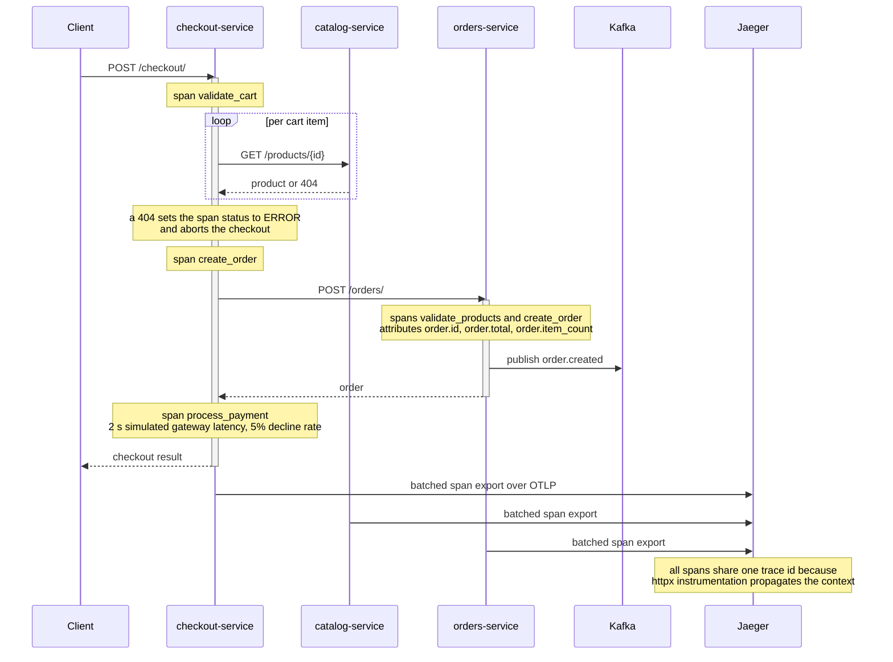

# Trace Sleuth - OpenTelemetry AI-Assisted Debugging Platform

An observability platform with 3 FastAPI microservices instrumented with OpenTelemetry, backed by Jaeger for distributed tracing, Kafka for event streaming, Prometheus/Grafana for metrics, and an MCP-powered AI debugger that correlates traces and generates root-cause summaries.

## Architecture

```mermaid
flowchart TB
    client["Client"]

    subgraph svcs["FastAPI microservices, each with setup_tracing"]
        co["checkout-service :8003<br/>validate_cart &#8594; place_order &#8594; process_payment"]
        ca["catalog-service :8001<br/>GET /products/{id}"]
        or["orders-service :8002<br/>validate_products, create_order"]
    end

    otel["OpenTelemetry SDK<br/>FastAPIInstrumentor + HTTPXClientInstrumentor<br/>W3C trace-context propagated on every httpx call<br/>BatchSpanProcessor &#8594; OTLP gRPC"]
    jaeger["Jaeger<br/>:4317 OTLP ingest, :16686 UI + query API"]
    kafka["Kafka topic order.created"]
    prom["Prometheus :9090"]
    graf["Grafana :3000"]

    subgraph dbg["AI debugger :8005"]
        srv["server.py<br/>POST /debug/investigate<br/>GET /debug/health-check<br/>GET /debug/recent-errors"]
        agent["DebugAgent<br/>LLM path: gpt-4o function calling,<br/>up to 10 tool rounds<br/>heuristic path when no API key"]
        tools["tools.py<br/>query_traces, get_trace_detail,<br/>get_error_spans, get_service_metrics,<br/>compare_traces"]
        rep["DebugReport<br/>root cause, affected services,<br/>timeline, recommendation"]
    end

    client --> co
    co -->|"HTTP, trace context in headers"| ca
    co -->|"HTTP, trace context in headers"| or
    or -->|"send_and_wait"| kafka
    co --> otel
    ca --> otel
    or --> otel
    otel --> jaeger
    svcs --> prom --> graf
    srv --> agent --> tools
    tools -->|"Jaeger query API"| jaeger
    tools -->|"PromQL"| prom
    agent --> rep --> srv
```



A single checkout, as it appears in one trace:



**Trace propagation:** Checkout calls Catalog and Orders via HTTP. OpenTelemetry auto-instrumentation on httpx propagates W3C trace-context headers, creating a single distributed trace across all 3 services. Each service adds custom spans with business attributes (order.id, product.id, payment.status).

## Prerequisites

- Docker and Docker Compose
- (Optional) OpenAI API key for LLM-powered debugging -- falls back to heuristic analysis without it

## Quick Start

```bash
cd deploy

# Without LLM (heuristic debugging)
docker-compose up --build

# With LLM-powered debugging
OPENAI_API_KEY=sk-... docker-compose up --build
```

All services will start:

| Service       | URL                        |
|---------------|----------------------------|
| Catalog       | http://localhost:8001       |
| Orders        | http://localhost:8002       |
| Checkout      | http://localhost:8003       |
| AI Debugger   | http://localhost:8005       |
| Jaeger UI     | http://localhost:16686      |
| Prometheus    | http://localhost:9090       |
| Grafana       | http://localhost:3000       |

## Triggering a Distributed Trace

Run a checkout that spans all 3 services:

```bash
# Full checkout flow (catalog -> orders -> payment)
curl -X POST http://localhost:8003/checkout/ \
  -H "Content-Type: application/json" \
  -d '{
    "items": [
      {"product_id": "prod-001", "quantity": 2},
      {"product_id": "prod-002", "quantity": 1}
    ],
    "customer_id": "user-42"
  }'
```

Individual service calls:

```bash
# List products
curl http://localhost:8001/products/

# Create an order directly
curl -X POST http://localhost:8002/orders/ \
  -H "Content-Type: application/json" \
  -d '{"items": [{"product_id": "prod-001", "quantity": 1}], "customer_id": "user-1"}'
```

## Viewing Traces in Jaeger

1. Open http://localhost:16686
2. Select "checkout-service" from the Service dropdown
3. Click "Find Traces"
4. Click any trace to see the full span waterfall across catalog, orders, and checkout services

## Using the AI Debugger

```bash
# Investigate an issue (uses LLM if OPENAI_API_KEY set, otherwise heuristic)
curl -X POST http://localhost:8005/debug/investigate \
  -H "Content-Type: application/json" \
  -d '{"issue": "Checkout requests are timing out intermittently"}'

# Proactive health check -- scans for anomalies
curl http://localhost:8005/debug/health-check

# View recent error traces
curl http://localhost:8005/debug/recent-errors
```

The AI debugger queries Jaeger traces and Prometheus metrics, correlates errors across services, and returns a structured report with root cause, affected services, timeline, and recommendations.

## Injecting Faults for Testing

The checkout service has a built-in 5% payment failure rate and 2-second payment latency. To generate error traces:

```bash
# Run 50 checkouts to trigger some payment failures
for i in $(seq 1 50); do
  curl -s -X POST http://localhost:8003/checkout/ \
    -H "Content-Type: application/json" \
    -d '{"items": [{"product_id": "prod-001", "quantity": 1}]}' &
done
wait

# Now investigate
curl -X POST http://localhost:8005/debug/investigate \
  -H "Content-Type: application/json" \
  -d '{"issue": "Some checkout requests are failing"}'
```

To trigger a product-not-found error:

```bash
curl -X POST http://localhost:8003/checkout/ \
  -H "Content-Type: application/json" \
  -d '{"items": [{"product_id": "nonexistent", "quantity": 1}]}'
```

## Grafana Dashboards

1. Open http://localhost:3000 (admin/admin)
2. Import the dashboard from `monitoring/grafana/dashboard.json`
3. Panels: request rate per service, error rate, latency percentiles (p50/p95/p99), checkout conversion rate

## Tests / End-to-End Check

There is no committed unit test suite; validate the deployment with the following smoke flow:

```bash
# 1. Bring up the stack
cd deploy && docker-compose up --build -d

# 2. Wait for all services to register, then drive load
for i in $(seq 1 50); do
  curl -s -X POST http://localhost:8003/checkout/ \
    -H "Content-Type: application/json" \
    -d '{"items":[{"product_id":"prod-001","quantity":1}],"customer_id":"u1"}' &
done; wait

# 3. Verify a distributed trace is recorded in Jaeger
curl -s "http://localhost:16686/api/traces?service=checkout-service&limit=1" | jq '.data | length'

# 4. Run an AI investigation and inspect the structured response
curl -s -X POST http://localhost:8005/debug/investigate \
  -H "Content-Type: application/json" \
  -d '{"issue":"Some checkouts failing"}' | jq .
```

## Evaluation (AI Debugger)

The AI debugger is an MCP-tool-using LLM agent that produces root-cause summaries from Jaeger
traces and Prometheus metrics. Treat it as an LLM/RAG retrieval-and-reasoning task and
evaluate offline:

| Metric | How to compute |
|--------|----------------|
| Retrieval recall | For each fault scenario, label the trace IDs / metric series that are causally relevant; measure fraction returned by the agent's tool calls |
| Root-cause exact match | Compare the agent's `root_cause` field against a labelled ground-truth service+failure-mode label per scenario |
| Faithfulness | Manually score whether every claim in the summary is supported by the traces/metrics actually retrieved (no hallucinated spans) |
| Latency p50 / p99 | Wrap `/debug/investigate` calls in a timing harness over N=100 scenarios |
| Heuristic vs. LLM lift | Run the same scenarios with and without `OPENAI_API_KEY` set; compare recall and exact match |

Build the labelled scenario set by reusing the injected faults already exercised in the load
script above (5% payment failure, product-not-found, latency spike) and recording the expected
root cause for each.

## Service Details

- **Catalog** (8001): Product CRUD with in-memory store. Custom spans for product lookup.
- **Orders** (8002): Order management. Validates products via Catalog HTTP call. Publishes `order.created` events to Kafka.
- **Checkout** (8003): Orchestrates checkout flow -- validates cart (Catalog), creates order (Orders), simulates payment (2s delay, 5% failure). Main entry point for distributed traces.
- **AI Debugger** (8005): MCP-powered agent with tools for querying Jaeger traces, Prometheus metrics, comparing traces, and generating root-cause analysis.
